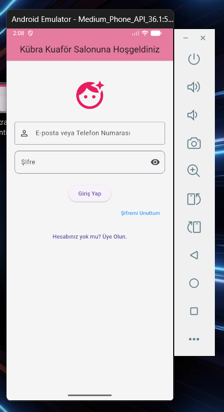
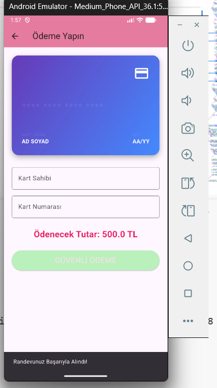
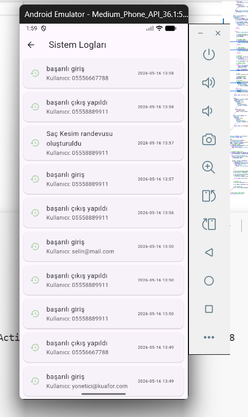
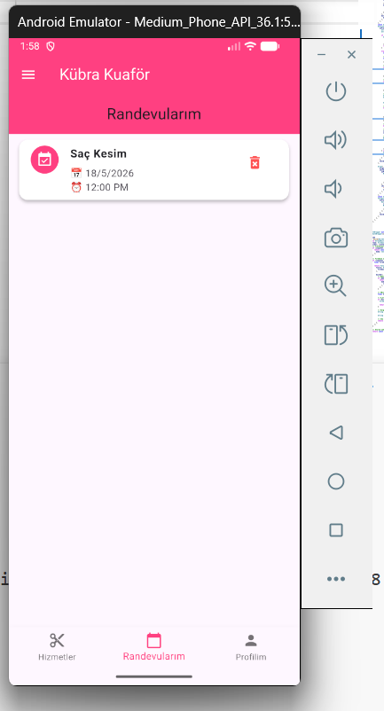
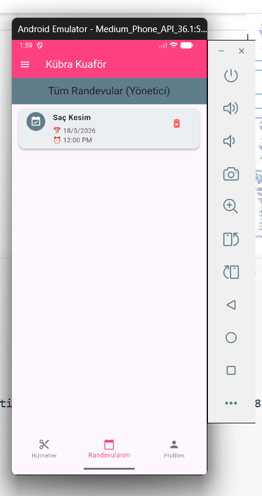
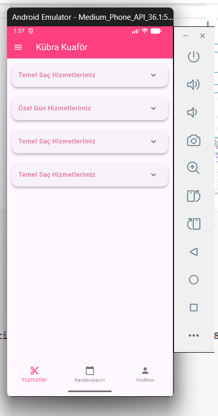
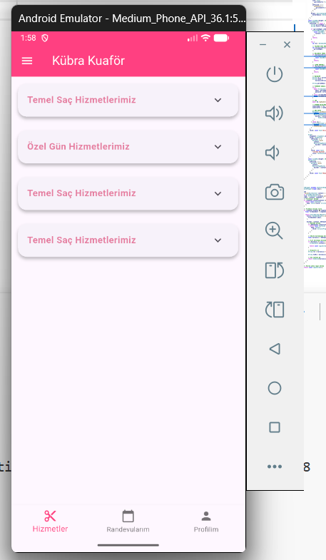
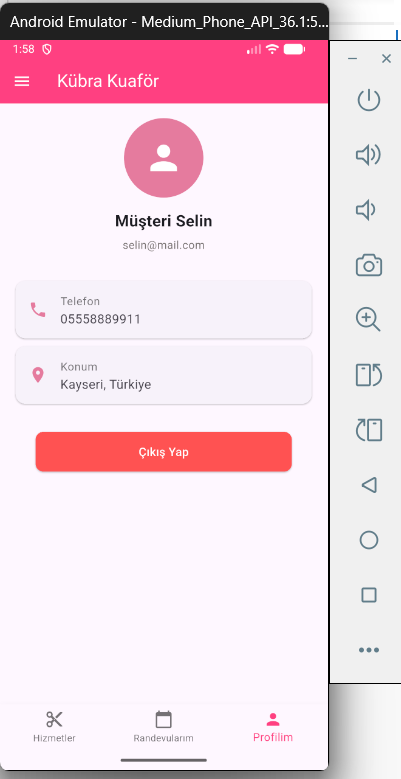
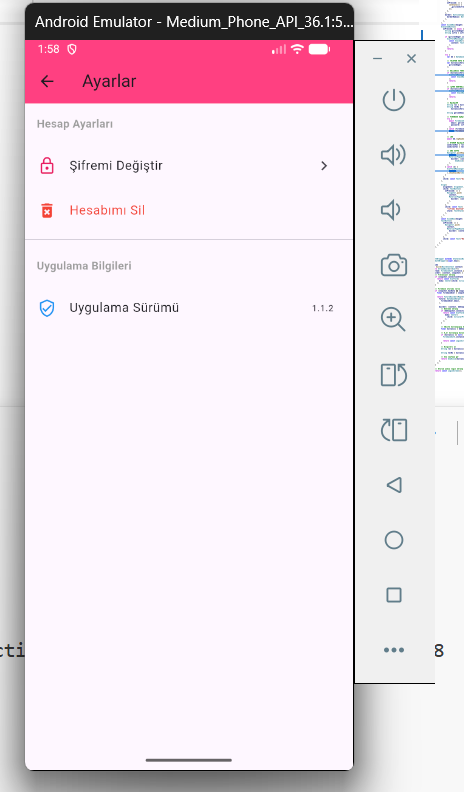

# ✂️ Kübra Kuaför Salonu - Mobil Uygulama projesi

Bu proje, bir kadın kuaför salonunun günlük hizmetlerini, randevu yönetimini ve müşteri rollerini dijitalleştirmek amacıyla **Flutter** framework'ü kullanılarak geliştirilmiş bir mobil uygulamadır.

## 👤 Öğrenci Bilgileri
* **Öğrenci Adı Soyadı:** Kübra Nur BOYRAZ
* **Öğrenci Numarası:** 243301029
* **Üniversite / Bölüm / Fakülte** Selçuk Üniversitesi - Bilgisayar Mühendisliği - Teknoloji Fakültesi

---

## 🚀 Projenin Öne Çıkan Özellikleri

* **Güvenli Giriş Sistemi:** Kullanıcılar sisteme hem **e-posta** adresleriyle hem de **telefon numaralarıyla**  güvenli bir şekilde giriş yapabilirler.
* **Dinamik Rol Yönetimi (RBAC):** Giriş yapan kullanıcının rolü veritabanından dinamik olarak okunur:
  * **Yönetici (Admin):** Salon operasyonlarını, hizmetleri ve tüm randevuları yönetebilir.
  * **Müşteri:** Hizmetleri görüntüleyebilir,  randevu alabilir ve geçmiş randevularını takip edebilir.
* *** Firebase Entegrasyonu:** Kimlik doğrulama süreçleri arka planda **Firebase Auth**  ile asenkron olarak senkronize edilir.
* **Performans Odaklı Yerel Veri Mimarisi:** Veri yönetimi ve kullanıcı rolleri yerel **SQLite** veritabanı mimarisi üzerinde kurgulanmıştır. Bu sayede uygulama çok hızlı  çalışır.
* **Hot Restart ve Oturum Koruması:** Hot Restart işlemlerinde en son aktif olan oturum açık kalır.
* **İşlem Günlüğü (Logging):** Sistemde yapılan başarılı girişler ve kritik işlemler güvenlik amacıyla yerelde loglanır. sadece yönetici görebilir 

---

## 🛠️ Kullanılan Paketler (Dependencies)

Projede kullanılan temel kütüphaneler ve sürümleri şu şekildedir:
* `firebase_core`: 2.24.0 
* `firebase_auth`: 4.15.0
* `sqflite`: Yerel veritabanı yönetimi ve SQL sorguları için
* `path`: Veritabanı dosya yolları güvenliği için

---

## 🧑‍💻 Test Hesapları Bilgileri

Uygulamayı test etmek ve roller arası geçişi incelemek için aşağıdaki hesap kombinasyonları tanımlanmıştır:

| Rol | E-Posta | Telefon Numarası | Şifre |
| :--- | :--- | :--- | :--- |
| **Yönetici (Kübra)** | `yonetici@kuafor.com` | `05556667788` | `kubra05` |
| **Müşteri (Selin)** | `selin@mail.com` | `05558889911` | `selin52` |

---

## 📸 Uygulama Ekran Görüntüleri

### 📱 Giriş, Kayıt ve Temel Ekranlar

  
  
  
  

### ✂️ Hizmetler ve Randevu Yönetim Ekranları

  
  
  
  

### 👤 Profil, Ayarlar ve Özet Ekranları

  
  
  

---

### 📈 GitHub Commit Geçmişi 

  

